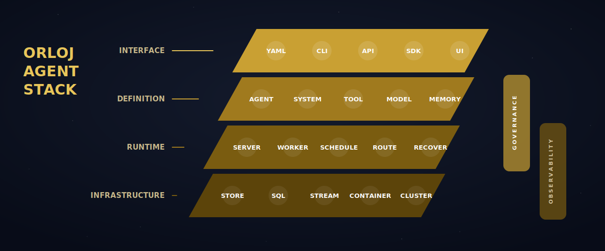
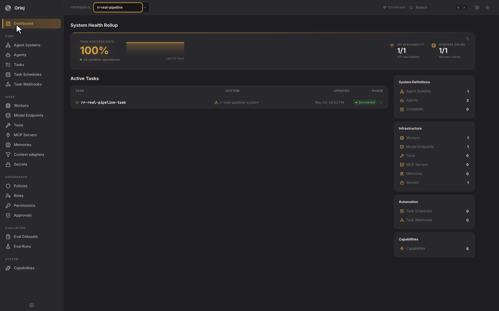
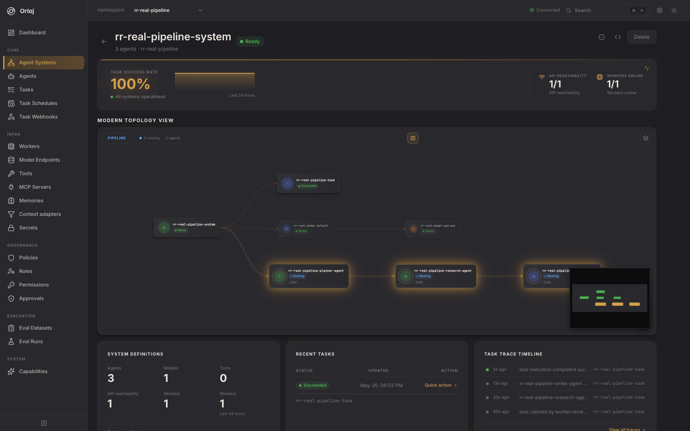
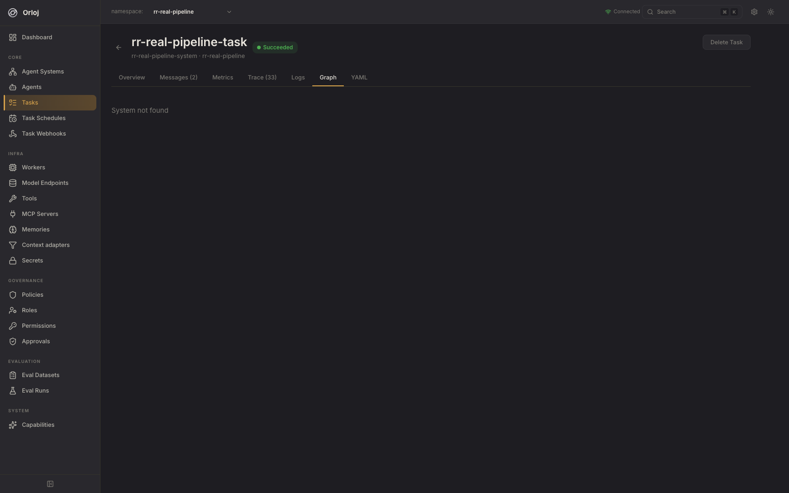
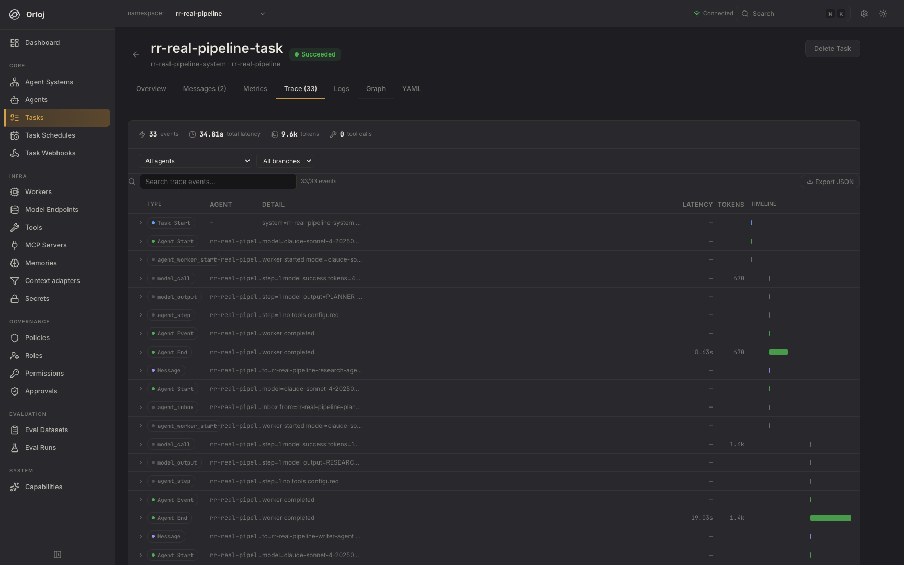

<p align="center">
  
</p>

# Agents are infrastructure.

## Orloj is the full stack for agentic systems.

Build, run, govern, and observe multi-agent systems from one declarative stack: agents, tools, models, memory, schedules, webhooks, approvals, policies, workers, traces, metrics, and deployment primitives.

**[Quickstart](#quickstart)** | **[Docs](https://docs.orloj.dev)** | **[Stack](#the-orloj-agent-stack)** | **[How It Works](#how-it-works)** | **[Screenshots](#screenshots)**

> **Status:** Orloj is under active development. APIs and resource schemas may change before 1.0.


## What Is Orloj?

Orloj is the open-source full stack for developing and operating agentic systems.

An agent system is no longer just a prompt and a loop. It has model routing, tool permissions, credentials, memory, retries,
human approvals, schedules, webhooks, workers, traces, logs, metrics, and deployment topology. Orloj treats those pieces the
way infrastructure platforms treat services: as versioned resources with desired state, status, controllers, leases,
workers, runtime policy, and operational visibility.

|                                            |                                                                                                                     |
| ------------------------------------------ | ------------------------------------------------------------------------------------------------------------------- |
| **If agents are services**                 | Orloj gives them manifests, runtime bounds, credentials, routing, observability, and lifecycle management.          |
| **If agent teams are distributed systems** | Orloj gives them durable handoffs, fan-out, fan-in, retries, idempotency, dead-letter states, and worker ownership. |
| **If tools are production access**         | Orloj gives them isolation, authorization, approval gates, retry policy, secrets, and audit-friendly traces.        |

## The Orloj Agent Stack

Orloj is not a single runtime component. It spans the layers teams need to develop, run, govern, and observe agentic systems.



| Stack Layer                      | What Orloj Provides                                                                                                                      |
| -------------------------------- | ---------------------------------------------------------------------------------------------------------------------------------------- |
| **Interfaces**                   | YAML manifests, `orlojctl`, REST API, SDKs, Kubernetes CRDs, and web console.                                                            |
| **Agent Definitions**            | `Agent`, `AgentSystem`, prompts, graph topology, roles, execution contracts, and runtime bounds.                                         |
| **Execution Runtime**            | Sequential and message-driven execution, workers, leases, heartbeats, retries, idempotency keys, and dead-letter states.                 |
| **Model & Context Layer**        | `ModelEndpoint`, `ContextAdapter`, provider routing, fallback models, secrets, token budgets, and `Memory`.                              |
| **Tool & Integration Layer**     | HTTP, gRPC, external services, webhook callbacks, `McpServer` discovery, CLI, WASM, A2A interop, auth, isolation, timeouts, and retries. |
| **Governance & Human Review**    | `AgentPolicy`, `AgentRole`, `ToolPermission`, `ToolApproval`, and `TaskApproval`.                                                        |
| **Observability & Operations**   | Traces, logs, messages, task history, watch streams, events, Prometheus metrics, OpenTelemetry spans, and UI views.                      |
| **State & Deployment Substrate** | In-memory and Postgres state, NATS JetStream messaging, Docker Compose, VPS deployments, Kubernetes paths, and CRD GitOps.               |

## How The Stack Operates

|                                                                                                                                 |                                                                                                                              |                                                                                                                      |
| ------------------------------------------------------------------------------------------------------------------------------- | ---------------------------------------------------------------------------------------------------------------------------- | -------------------------------------------------------------------------------------------------------------------- |
| **Declare:** Write YAML resources for agents, systems, tools, model endpoints, memory, tasks, secrets, evaluations, and policy. | **Reconcile:** Controllers validate resources, update status, discover MCP tools, manage schedules, and drive state forward. | **Schedule:** Tasks target an AgentSystem and are assigned to workers based on capacity and requirements.            |
| **Claim:** Workers claim tasks with leases, renew heartbeats, and allow takeover when ownership expires.                        | **Execute:** Bounded agent loops route model calls, invoke tools, use memory, and pass messages through the graph.           | **Govern:** Policies, roles, tool permissions, ToolApprovals, and TaskApprovals fail closed during runtime.          |
| **Observe:** Every run records trace events, task history, messages, logs, metrics, and optional OpenTelemetry spans.           | **Scale:** Start local with an embedded worker, then move to Postgres, NATS JetStream, and distributed workers.              | **Operate:** Use the CLI, REST API, watch streams, web console, Prometheus metrics, and standard deployment targets. |

## Orloj Is Right For You If

|                                                                                                                              |
| ---------------------------------------------------------------------------------------------------------------------------- |
| You are moving from agent demos to systems that need owners, policies, retries, credentials, and traces.                     |
| You want agents, tools, models, and workflows in version-controlled manifests instead of scattered scripts.                  |
| You need multiple agents to hand off work through pipelines, hierarchies, fan-out, fan-in, loops, or delegated review.       |
| You need tool calls to be authorized, isolated, approved, retried, and observable.                                           |
| You want to develop locally in one process and keep the same resource model when you scale to workers and durable messaging. |

## Problems Orloj Solves

| Without Orloj                                                                                   | With Orloj                                                                                                                      |
| ----------------------------------------------------------------------------------------------- | ------------------------------------------------------------------------------------------------------------------------------- |
| Agent scripts, prompts, tool configs, and credentials drift across repos and machines.          | Agents, tools, models, memory, triggers, workers, and policy are declared as resources and applied through one API.             |
| Multi-agent handoffs are hidden in custom code and hard to inspect after the run.               | AgentSystem graphs define the routing, while Task status records messages, branches, joins, delegation, trace, and history.     |
| A failed process can leave work half-owned, duplicated, or silently lost.                       | Workers claim tasks with leases and heartbeats. Retries, idempotency keys, and dead-letter phases make failure visible.         |
| Tool access is whatever the prompt or script happens to allow.                                  | Tool execution passes through policies, roles, permissions, operation rules, isolation modes, timeouts, retries, and approvals. |
| Switching model providers means editing every agent or duplicating config.                      | Agents reference ModelEndpoint resources, with provider-specific config, secrets, and fallback routing centralized.             |
| Recurring and event-driven agent work needs separate cron jobs, webhook glue, and dedupe logic. | TaskSchedule and TaskWebhook resources create Tasks from templates with concurrency, signature verification, and idempotency.   |
| Debugging requires reading scattered logs and guessing what each agent did.                     | Task traces capture model calls, tool calls, errors, token usage, latency, approvals, retries, messages, and output.            |

## What Is In The Stack

| Layer            | Resources and Runtime Behavior                                                                                                                 |
| ---------------- | ---------------------------------------------------------------------------------------------------------------------------------------------- |
| **Agents**       | `Agent` resources define prompts, model refs, fallback models, tools, roles, memory access, execution contracts, and bounds.                   |
| **Systems**      | `AgentSystem` resources compose agents into graphs with edges, conditional routing, fan-out, fan-in, delegation, and human review checkpoints. |
| **Tasks**        | `Task` resources execute an AgentSystem and track phase, output, attempts, leases, messages, joins, delegation, trace, history, and blockers.  |
| **Models**       | `ModelEndpoint` resources route calls to OpenAI, Anthropic, AWS Bedrock, Azure OpenAI, Ollama, mock, and OpenAI-compatible providers.          |
| **Context**      | `ContextAdapter` resources sanitize or transform raw task input before an AgentSystem starts.                                                  |
| **Tools**        | `Tool` resources support HTTP, external services, gRPC, webhook callbacks, MCP, CLI, WASM, and A2A with runtime policy and auth.               |
| **Integrations** | `McpServer` resources connect external MCP servers and materialize discovered tools.                                                           |
| **Memory**       | `Memory` resources back task-scoped and persistent memory through in-memory, pgvector, or HTTP providers.                                      |
| **Secrets**      | `Secret` resources hold runtime credentials, while `SealedSecret` resources support git-safe encrypted secret manifests.                       |
| **Triggers**     | `TaskSchedule` and `TaskWebhook` resources create Tasks from cron schedules and signed HTTP events.                                            |
| **Governance**   | `AgentPolicy`, `AgentRole`, `ToolPermission`, `ToolApproval`, and `TaskApproval` enforce model, tool, and review controls at runtime.          |
| **Evaluation**   | `EvalDataset` and `EvalRun` resources test agent systems against golden data and compare runs.                                                 |
| **Workers**      | `Worker` resources declare capacity, region, supported models, GPU support, heartbeat, and current task load.                                  |

## Example: An Agent System As Code

Define an agent:

```yaml
apiVersion: orloj.dev/v1
kind: Agent
metadata:
  name: research-agent
spec:
  model_ref: openai-default
  prompt: |
    You are the research stage.
    Produce concise, verifiable findings for the writer.
  tools:
    - web_search
  allowed_tools:
    - web_search
  limits:
    max_steps: 6
    timeout: 30s
```

Bind it to a model endpoint:

```yaml
apiVersion: orloj.dev/v1
kind: ModelEndpoint
metadata:
  name: openai-default
spec:
  provider: openai
  base_url: https://api.openai.com/v1
  default_model: gpt-4o
  auth:
    secretRef: openai-api-key
```

Wire agents into a graph:

```yaml
apiVersion: orloj.dev/v1
kind: AgentSystem
metadata:
  name: report-system
spec:
  agents:
    - planner-agent
    - research-agent
    - writer-agent
  graph:
    planner-agent:
      edges:
        - to: research-agent
    research-agent:
      edges:
        - to: writer-agent
```

Run it as a task:

```yaml
apiVersion: orloj.dev/v1
kind: Task
metadata:
  name: weekly-report
spec:
  system: report-system
  input:
    topic: enterprise AI copilots
  retry:
    max_attempts: 2
    backoff: 2s
  message_retry:
    max_attempts: 2
    backoff: 250ms
    max_backoff: 2s
    jitter: full
```

## Governance Built Into The Runtime

Governance in Orloj is not a documentation convention. It is evaluated while work is being executed.

|                    |                                                                                               |
| ------------------ | --------------------------------------------------------------------------------------------- |
| **AgentPolicy**    | Constrains allowed models, blocked tools, token budget, child depth, and child task creation. |
| **AgentRole**      | Grants named permissions to agents.                                                           |
| **ToolPermission** | Defines what permissions or operation rules are required for a tool invocation.               |
| **ToolApproval**   | Pauses risky tool calls until a reviewer approves or denies them.                             |
| **TaskApproval**   | Pauses graph nodes or final output for human review, denial, or request-changes loops.        |

Unauthorized actions fail closed and appear in the task trace.

## How It Works

| Component         | Responsibility                                                                                                                                                 |
| ----------------- | -------------------------------------------------------------------------------------------------------------------------------------------------------------- |
| `orlojd`          | Runs the REST API, web console, resource stores, watch/event endpoints, controllers, schedulers, and optional embedded worker.                                 |
| `orlojworker`     | Claims tasks, renews leases, executes agent graphs, consumes message-driven inboxes, routes models, invokes tools, and reports status.                         |
| `orlojctl`        | Applies manifests, scaffolds systems, creates secrets, runs tasks, watches resources, reviews approvals, inspects logs, traces, graphs, messages, and metrics. |
| **Storage**       | Uses in-memory storage for local development or Postgres for production resource state, task claiming, leases, and persistence.                                |
| **Messaging**     | Uses sequential mode for local simplicity or message-driven mode with memory or NATS JetStream for distributed handoffs.                                       |
| **Observability** | Exposes task trace and history, task logs, message lifecycle, Prometheus metrics, OpenTelemetry spans, structured logs, and web console views.                 |

## Screenshots

### Operator Dashboard



System status and active workload at a glance.

### System Topology



Inspect the graph that connects agents.

### Task Graph



Follow node-level execution progress.

### Trace And Logs



Debug model calls, tool calls, latency, errors, and output.

## Quickstart

Install the CLI:

```bash
brew tap OrlojHQ/orloj
brew install orlojctl
```

Or install the binaries:

```bash
curl -sSfL https://raw.githubusercontent.com/OrlojHQ/orloj/main/scripts/install.sh | sh
```

Start Orloj with an embedded worker and in-memory state:

```bash
orlojd --storage-backend=memory --embedded-worker
```

Scaffold a pipeline:

```bash
orlojctl init demo
```

Create the model secret expected by the scaffold:

```bash
orlojctl create secret openai-api-key --from-literal value=sk-your-key-here
```

Apply the resources and include the sample task:

```bash
orlojctl apply -f demo/ --run
```

Run a new task with your own input:

```bash
orlojctl run --system demo-system topic="The future of open source AI"
```

Inspect the run:

```bash
orlojctl get tasks
orlojctl trace task <task-name>
orlojctl logs task/<task-name>
```

Open the console at [http://127.0.0.1:8080/](http://127.0.0.1:8080/).

## Production Shape

Local development can run in one process. Production can split the Orloj server and workers:

|                      |                                                                                                  |
| -------------------- | ------------------------------------------------------------------------------------------------ |
| **Local**            | `orlojd --storage-backend=memory --embedded-worker`                                              |
| **Persistent**       | `orlojd --storage-backend=postgres` with Postgres-backed resource state.                         |
| **Distributed**      | `orlojd` plus one or more `orlojworker` processes with message-driven execution.                 |
| **Durable handoffs** | `--agent-message-bus-backend=nats-jetstream` for runtime agent messages.                         |
| **Observability**    | `/metrics`, OpenTelemetry export, task traces, logs, message views, and the web console.         |
| **GitOps**           | Optional Kubernetes CRD operator syncs Orloj resource definitions from Kubernetes into Postgres. |

Configure `ORLOJ_POSTGRES_DSN` before using the Postgres examples. Configure `ORLOJ_NATS_URL` or
`ORLOJ_AGENT_MESSAGE_NATS_URL` when NATS is not running on the default local address.

```bash
orlojd \
  --storage-backend=postgres \
  --task-execution-mode=message-driven \
  --agent-message-bus-backend=nats-jetstream
```

```bash
orlojworker \
  --storage-backend=postgres \
  --task-execution-mode=message-driven \
  --agent-message-bus-backend=nats-jetstream \
  --agent-message-consume
```

## Security

Orloj is built secure-by-default: fail-closed governance, tool sandboxing, SSRF protection, encrypted secrets, and release images signed with SBOMs and build provenance. CI runs dependency, static-analysis (CodeQL), secret, and container scanning on every change.

These controls are designed to align with the [NIST SSDF](https://csrc.nist.gov/projects/ssdf) and map to ISO/IEC 27002 and NIST CSF control families. Orloj is not currently certified against any standard (ISO 27001 / SOC 2 are organizational certifications, not code certifications). See the [Security](https://docs.orloj.dev/operations/security) and [Threat Model](https://docs.orloj.dev/operations/threat-model) docs, and report vulnerabilities via [SECURITY.md](SECURITY.md).

## What Orloj Is Not

|                               |                                                                                                                                                 |
| ----------------------------- | ----------------------------------------------------------------------------------------------------------------------------------------------- |
| **Not an agent framework**    | Orloj does not force a prompt style or reasoning pattern. It operates the stack around agents as infrastructure resources.                      |
| **Not a prompt manager**      | Prompts live in Agent manifests, but the product is the operating stack around execution, routing, policy, and operations.                      |
| **Not just governance**       | Governance is built in, but Orloj also handles scheduling, workers, model routing, memory, tools, triggers, messaging, traces, and deployments. |
| **Not just a dashboard**      | The web console is an operator UI over the same API and resource model used by `orlojctl` and automation.                                       |
| **Not a toy workflow runner** | The same manifest model can run locally, with Postgres persistence, or across distributed workers and durable message queues.                   |

## Docs And Examples

|                                                                              |                                                                                |
| ---------------------------------------------------------------------------- | ------------------------------------------------------------------------------ |
| [5-minute tutorial](https://docs.orloj.dev/guides/five-minute-tutorial)      | Scaffold, configure a model key, and run a first agent system.                 |
| [Architecture](https://docs.orloj.dev/concepts/architecture)                 | Server, workers, governance, execution modes, and reliability characteristics. |
| [Starter blueprints](https://docs.orloj.dev/guides/starter-blueprints)       | Pipeline, hierarchical, and swarm-loop topologies.                             |
| [Governance guide](https://docs.orloj.dev/guides/setup-governance)           | Policies, roles, tool permissions, and runtime enforcement.                    |
| [MCP servers](https://docs.orloj.dev/guides/connect-mcp-server)              | Connect MCP servers and auto-discover tools.                                   |
| [A2A interoperability](https://docs.orloj.dev/concepts/a2a-interoperability) | Expose agents as A2A endpoints and call remote A2A agents as tools.            |
| [Agent evaluation](https://docs.orloj.dev/guides/run-agent-evaluation)       | Run datasets, score outputs, and compare agent system changes.                 |
| [Kubernetes CRD operator](https://docs.orloj.dev/deploy/kubernetes-operator) | Manage Orloj resources with Kubernetes CRDs and GitOps workflows.              |
| [Deploy and operate](https://docs.orloj.dev/deploy/)                         | Local, VPS, Kubernetes, remote CLI access, and production configuration.       |
| Examples                                                                     | Resource samples, blueprints, and use-case bundles.                            |

Useful CLI entry points:

```bash
orlojctl validate -f manifests/
orlojctl seal secret openai-api-key --from-literal value=sk-your-key-here --stdout
orlojctl eval run --dataset <dataset> --system <agent-system>
```

## SDKs

Use the REST API directly, operate through `orlojctl`, or call Orloj from application code with official SDKs.

| Language   | Install                 | Package                                     | Repository                                                |
| ---------- | ----------------------- | ------------------------------------------- | --------------------------------------------------------- |
| Python     | `pip install orloj-sdk` | [PyPI](https://pypi.org/project/orloj-sdk/) | [Repository](https://github.com/OrlojHQ/orloj-python-sdk) |
| TypeScript | `npm install orloj`     | [npm](https://www.npmjs.com/package/orloj)  | [Repository](https://github.com/OrlojHQ/orloj-js-sdk)     |

## Contributing

See [CONTRIBUTING.md](CONTRIBUTING.md) for environment setup, test matrix, and PR lifecycle details.

Helpful starting points:

- [Good first issue](https://github.com/OrlojHQ/orloj/issues?q=is%3Aissue%20is%3Aopen%20label%3A%22good%20first%20issue%22)
- [Help wanted](https://github.com/OrlojHQ/orloj/issues?q=is%3Aissue%20is%3Aopen%20label%3A%22help%20wanted%22)
- [Use-case contribution guide](examples/use-cases/CONTRIBUTING.md)

## License

Apache License 2.0. See [LICENSE](LICENSE), [NOTICE](NOTICE), and [TRADEMARKS.md](TRADEMARKS.md).

Optional attribution is welcome — for example, a “Powered by Orloj” link in a UI footer, docs, or about page. See [TRADEMARKS.md](TRADEMARKS.md) for allowed uses and badge assets.
