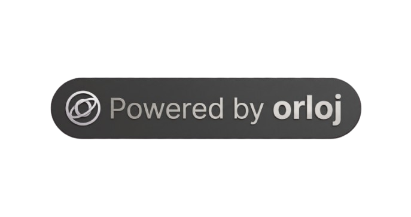

# Trademark Policy

This policy covers names, logos, and marks for the Orloj project.

Related guidance: [README License section](README.md#license).

## Ownership

- "Orloj" and related logos/marks are trademarks of the project owner.
- This repository's open-source license does not grant trademark rights.

## Allowed Uses

- You may use the project name to truthfully describe compatibility.
- You may link to this project and reference it in documentation or reviews.
- You may use unmodified logos only when clearly referring to this project.

### Optional attribution

If your product or service incorporates Orloj, you may use optional, truthful attribution such as:

- "Powered by Orloj"
- "Built with Orloj"

in UIs, documentation, release notes, or marketing.

Guidelines:

- Keep your product's name and branding primary; Orloj attribution should be secondary and accurate.
- Linking to https://orloj.dev or the upstream repository is encouraged.
- Do not use phrasing that implies official status or endorsement (e.g. "Official Orloj", "Orloj Enterprise Edition by Acme") without permission.
- Do not use the Orloj name as all or part of your product name for a fork or wrapped offering (see Prohibited Uses).

Badge assets (use unmodified; link to https://orloj.dev):

```markdown
[](https://orloj.dev)
```

Use `docs/public/badge-powered-by-orloj-light.png` on light backgrounds.

## Prohibited Uses

- Do not imply endorsement, partnership, or official status without permission.
- Do not use the marks in product names for forks or derivative services.
- Do not use confusingly similar names, logos, or branding.
- Do not register domains, company names, or social handles that create confusion.

## Forks and Derivative Distributions

- You may fork and redistribute the code under the repository license.
- If you distribute a fork, you must use distinct branding.
- Remove or replace project logos/marks from your distribution unless licensed.

## Requests

If you need explicit trademark permission for a use case, open an issue to discuss.
