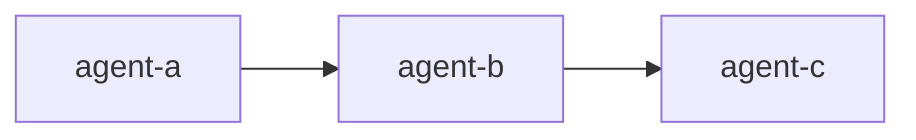

# <Scenario Name> (<topology>)

## What this is for

Describe the real-world problem this scenario solves in 2-4 sentences.

## Who it is for

- Primary audience 1
- Primary audience 2

## When to use something else

- Condition where another use case is a better fit -> link to that use case README.
- Another condition where this template is not ideal.

## What you get

- List of key resources this bundle creates (`AgentSystem`, `Task`, etc.).
- Important execution behavior (join mode, loop bound, trigger model).
- Optional governance/integration resources when relevant (`AgentPolicy`, `AgentRole`, `ToolPermission`, `Memory`, `Tool`, `McpServer`, `Worker`, `TaskSchedule`, `TaskWebhook`).

## Topology



## Files in this folder

| File | Resource |
| --- | --- |
| `model-endpoint.yaml` | `ModelEndpoint` |
| `secret-openai.yaml` | `Secret` |
| `agents/*.yaml` | Scenario-specific `Agent` resources |
| `agent-system.yaml` | `AgentSystem` |
| `task.yaml` | Primary `Task` |
| `agent-policy.yaml` (optional) | `AgentPolicy` |
| `agent-role.yaml` (optional) | `AgentRole` |
| `tool-permission*.yaml` (optional) | `ToolPermission` |
| `tool*.yaml` (optional) | `Tool` |
| `memory*.yaml` (optional) | `Memory` |
| `mcp-server*.yaml` (optional) | `McpServer` |
| `worker*.yaml` (optional) | `Worker` |
| `task-schedule.yaml` (optional) | `TaskSchedule` |
| `task-webhook.yaml` (optional) | `TaskWebhook` |

## Apply (from repository root)

```bash
go run ./cmd/orlojctl apply -f examples/use-cases/<slug>/ --run
```

If secrets or model endpoints already exist in your environment, explicitly call out which files can be skipped.

If the scenario includes optional governance or integration resources, include them in the apply order and document prerequisite secrets or external services.

If you intentionally want to skip runnable tasks during directory apply, omit `--run` and apply runnable task files explicitly.

## Expected Output Markers

Document deterministic checks that validate the scenario worked:

- Marker 1: `EXPECTED_MARKER_A`
- Marker 2: `EXPECTED_MARKER_B`

## Cleanup

Provide cleanup commands when the scenario creates long-lived resources:

```bash
go run ./cmd/orlojctl delete -f examples/use-cases/<slug>/task.yaml
```

## Related use cases

- Link to 2-3 adjacent scenarios.
