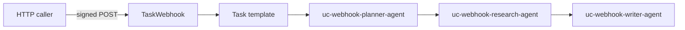

# Event-driven webhook runs

## What this is for

This bundle shows how to **trigger multi-agent work from outside Orloj**: an HTTP client (CI job, internal service, script) POSTs a **signed** payload to a **`TaskWebhook`**, which creates a **new `Task`** from a **`Task` template** wired to a small **pipeline** (`planner → research → writer`).

Typical uses: **turn a ticket or PR event into a draft summary**, **react to a queue or webhook from SaaS**, or **kick off the same graph from automation** without using the UI or CLI for each run.

The raw HTTP body is mapped into task input as **`webhook_payload`** (see `task-webhook.yaml`), so the first agent can interpret whatever JSON or text your caller sends.

## Who it is for

- **Platform and integration engineers** connecting Orloj to existing event streams.
- Teams that already like a **pipeline** shape but need **push** triggers instead of only cron or manual tasks.

## When to use something else

- **Recurring schedule only** (no HTTP) → use **`TaskSchedule`** with a template, e.g. [weekly-intelligence-brief](../weekly-intelligence-brief/task-schedule.yaml).
- **Larger org chart / merge** → [Cross-functional program office](../cross-functional-pmo/README.md).
- **GitHub-native signatures** → adapt this pattern with `profile: github` (see [`examples/resources/task-webhooks/github_push_webhook.yaml`](../../resources/task-webhooks/github_push_webhook.yaml)).

## What you get

A **self-contained** directory: its own **three agents**, **`AgentSystem`** `uc-webhook-pipeline-system`, **`Task`** template `uc-webhook-template-task`, **`TaskWebhook`** `uc-webhook-generic`, plus **OpenAI** and **webhook HMAC** secrets. You can copy the folder alone without applying other use cases.

After apply, inspect **`TaskWebhook.status`** for the **`endpointPath`** to POST deliveries. Signing and idempotency follow [Webhooks operations](../../../docs/pages/operations/webhooks.md).

## Topology



## Files in this folder

| File | Resource |
| --- | --- |
| `model-endpoint.yaml`, `secret-openai.yaml` | Model routing + OpenAI key |
| `secret-webhook.yaml` | HMAC secret `uc-webhook-hmac-secret` (edit before apply) |
| `agents/*.yaml` | Three pipeline agents |
| `agent-system.yaml` | `AgentSystem` `uc-webhook-pipeline-system` |
| `task-template.yaml` | Template `uc-webhook-template-task` |
| `task-webhook.yaml` | `TaskWebhook` `uc-webhook-generic` |

## Apply order (from repository root)

```bash
go run ./cmd/orlojctl apply -f examples/use-cases/event-driven-webhook/model-endpoint.yaml
go run ./cmd/orlojctl apply -f examples/use-cases/event-driven-webhook/secret-openai.yaml
go run ./cmd/orlojctl apply -f examples/use-cases/event-driven-webhook/secret-webhook.yaml

go run ./cmd/orlojctl apply -f examples/use-cases/event-driven-webhook/agents/planner.yaml
go run ./cmd/orlojctl apply -f examples/use-cases/event-driven-webhook/agents/research.yaml
go run ./cmd/orlojctl apply -f examples/use-cases/event-driven-webhook/agents/writer.yaml
go run ./cmd/orlojctl apply -f examples/use-cases/event-driven-webhook/agent-system.yaml
go run ./cmd/orlojctl apply -f examples/use-cases/event-driven-webhook/task-template.yaml
go run ./cmd/orlojctl apply -f examples/use-cases/event-driven-webhook/task-webhook.yaml
```

Use **message-driven** workers with `--agent-message-consume` for multi-agent graphs.

## Repointing at another system

Edit **`task-template.yaml`** `spec.system` to target a different **`AgentSystem`** (and align `metadata.name` / `task_ref` if you rename the template).

## Related use cases

- [Weekly intelligence brief](../weekly-intelligence-brief/README.md) (cron + template)
- [Webhooks operations](../../../docs/pages/operations/webhooks.md)

## Try this next

- Switch the webhook to **`profile: github`** using [`examples/resources/task-webhooks/github_push_webhook.yaml`](../../resources/task-webhooks/github_push_webhook.yaml) as a template.
