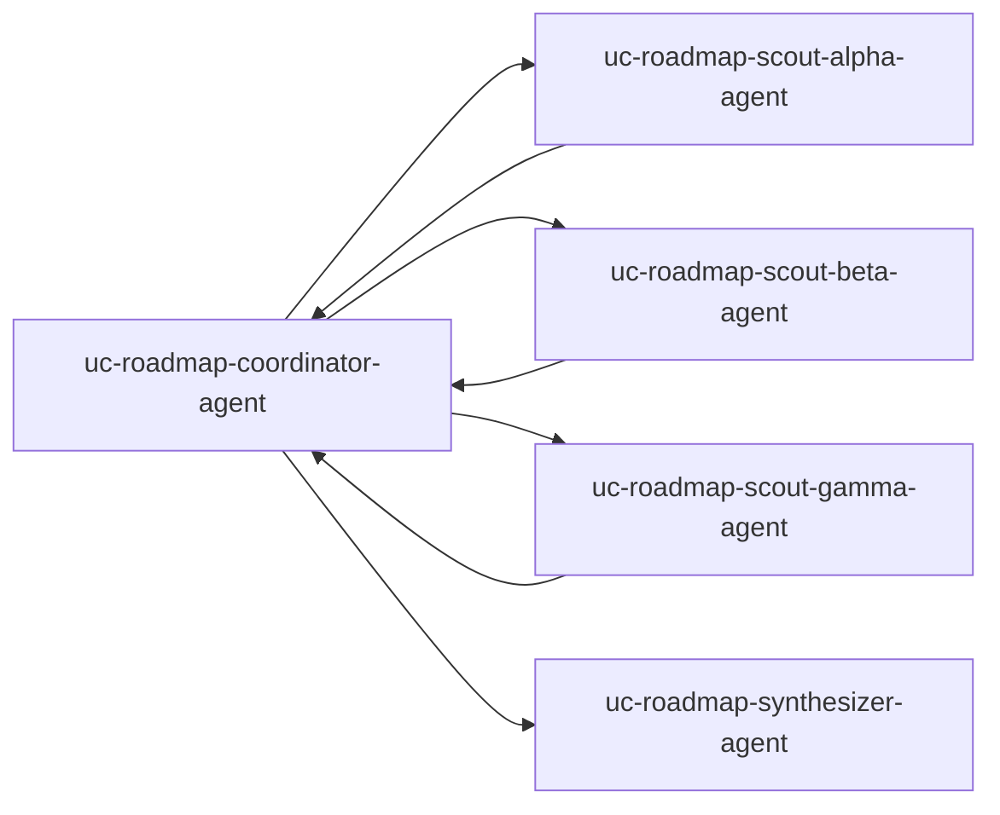

# Roadmap bets and synthesis (swarm + loop)

## What this is for

This bundle models **strategic or roadmap work** where you want **several “scouts”** to explore **different dimensions in parallel** (e.g. technical risk, market, customer impact), send updates back to a **coordinator**, optionally go another round, then hand everything to a **synthesizer** for a **single ranked outcome**.

It is the right shape when **one linear pipeline** would over-serialize discovery, but you still need a **bounded** conversation: **`Task.spec.max_turns`** caps how long coordinator–scout loops can run.

## Who it is for

- **Product managers**, **strategy**, or **tech leads** running quarterly planning, bet prioritization, or “build vs buy” framing.
- Teams that outgrow a simple **planner → research → writer** line but do not need a **two-branch merge** like the [program office](../cross-functional-pmo/README.md).

## When to use something else

- **Predictable single-thread brief** → [Weekly intelligence brief](../weekly-intelligence-brief/README.md).
- **Two formal workstreams that must both complete before an editor merges** → [Cross-functional program office](../cross-functional-pmo/README.md).
- **External systems firing runs over HTTP** → [Event-driven webhook](../event-driven-webhook/README.md).

## What you get

- Coordinator, **three scouts**, synthesizer, and **`AgentSystem`** `uc-roadmap-swarm-system` with **feedback edges** from each scout back to the coordinator.
- **`Task`** `uc-roadmap-swarm-task` with **`max_turns: 4`** and a sample roadmap topic in `spec.input`.

## Topology



## Files in this folder

| File | Resource |
| --- | --- |
| `model-endpoint.yaml`, `secret-openai.yaml` | Model routing + API key |
| `agents/*.yaml` | Coordinator, three scouts, synthesizer |
| `agent-system.yaml` | `AgentSystem` `uc-roadmap-swarm-system` |
| `task.yaml` | `Task` `uc-roadmap-swarm-task` (includes `max_turns`) |

## Apply order (from repository root)

```bash
go run ./cmd/orlojctl apply -f examples/use-cases/roadmap-synthesis-swarm/model-endpoint.yaml
go run ./cmd/orlojctl apply -f examples/use-cases/roadmap-synthesis-swarm/secret-openai.yaml

go run ./cmd/orlojctl apply -f examples/use-cases/roadmap-synthesis-swarm/agents/coordinator.yaml
go run ./cmd/orlojctl apply -f examples/use-cases/roadmap-synthesis-swarm/agents/scout_alpha.yaml
go run ./cmd/orlojctl apply -f examples/use-cases/roadmap-synthesis-swarm/agents/scout_beta.yaml
go run ./cmd/orlojctl apply -f examples/use-cases/roadmap-synthesis-swarm/agents/scout_gamma.yaml
go run ./cmd/orlojctl apply -f examples/use-cases/roadmap-synthesis-swarm/agents/synthesizer.yaml
go run ./cmd/orlojctl apply -f examples/use-cases/roadmap-synthesis-swarm/agent-system.yaml
go run ./cmd/orlojctl apply -f examples/use-cases/roadmap-synthesis-swarm/task.yaml
```

**Message-driven** execution with `--agent-message-consume` matters here for **realistic parallel fan-out** ([Starter blueprints](../../../docs/pages/guides/starter-blueprints.md)).

## Related use cases

- [Weekly intelligence brief](../weekly-intelligence-brief/README.md)
- [Cross-functional program office](../cross-functional-pmo/README.md)

## Try this next

- Add a **`Task` template** and **`TaskSchedule`** (copy the pattern from [weekly-intelligence-brief](../weekly-intelligence-brief/task-template.yaml)) for recurring strategy runs.
- Tighten **`max_turns`** and per-agent **`limits`** to match your budget.
