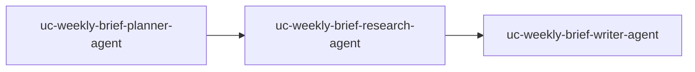

# Weekly intelligence brief (pipeline)

## What this is for

This bundle models a **recurring or ad-hoc research brief**: someone gives a **topic**, and the system moves it through **plan → research → write** in order. It fits anything you would otherwise do as a linear checklist—market snapshots, competitor notes, exec summaries, or “what happened this week in X.”

You get **one clear handoff at each stage**, which makes runs easier to reason about, debug, and cost-estimate than parallel or looping graphs.

## Who it is for

- **Novice users** learning Orloj with a small, understandable graph.
- **Small teams** that want a default pattern before adding tools, memory, or governance.

## When to use something else

- **Two parallel workstreams that must merge** (e.g. research + comms) → [Cross-functional program office](../cross-functional-pmo/README.md) (hierarchical).
- **Exploring many angles with iteration** → [Roadmap synthesis swarm](../roadmap-synthesis-swarm/README.md).
- **Runs triggered by HTTP** → [Event-driven webhook](../event-driven-webhook/README.md).

## What you get

- A one-shot **`Task`** (`uc-weekly-brief-task`) with sample `spec.input.topic`.
- Optionally a **`Task` template** plus **`TaskSchedule`** so the same system can spawn runs on a cron (Mondays 09:00 UTC in the sample).

## Topology



## Files in this folder

| File | Resource |
| --- | --- |
| `model-endpoint.yaml` | `ModelEndpoint` `openai-default` |
| `secret-openai.yaml` | `Secret` `openai-api-key` (edit before apply) |
| `agents/*.yaml` | Three `Agent` resources |
| `agent-system.yaml` | `AgentSystem` `uc-weekly-brief-system` |
| `task.yaml` | One-shot `Task` `uc-weekly-brief-task` |
| `task-template.yaml` | `Task` template `uc-weekly-brief-template` (for schedule/webhook-style automation) |
| `task-schedule.yaml` | `TaskSchedule` → that template |

If `openai-default` / `openai-api-key` already exist in your environment, skip the model and OpenAI secret files.

## Apply order (from repository root)

```bash
# 1) Credentials — edit secret-openai.yaml first
go run ./cmd/orlojctl apply -f examples/use-cases/weekly-intelligence-brief/model-endpoint.yaml
go run ./cmd/orlojctl apply -f examples/use-cases/weekly-intelligence-brief/secret-openai.yaml

# 2) Graph
go run ./cmd/orlojctl apply -f examples/use-cases/weekly-intelligence-brief/agents/planner.yaml
go run ./cmd/orlojctl apply -f examples/use-cases/weekly-intelligence-brief/agents/research.yaml
go run ./cmd/orlojctl apply -f examples/use-cases/weekly-intelligence-brief/agents/writer.yaml
go run ./cmd/orlojctl apply -f examples/use-cases/weekly-intelligence-brief/agent-system.yaml
go run ./cmd/orlojctl apply -f examples/use-cases/weekly-intelligence-brief/task.yaml

# 3) Optional: recurring runs from the template
go run ./cmd/orlojctl apply -f examples/use-cases/weekly-intelligence-brief/task-template.yaml
go run ./cmd/orlojctl apply -f examples/use-cases/weekly-intelligence-brief/task-schedule.yaml
```

Run workers with **message-driven** execution and `--agent-message-consume` as in [Starter blueprints](../../../docs/pages/guides/starter-blueprints.md).

## Related use cases

- [Cross-functional program office](../cross-functional-pmo/README.md)
- [Roadmap synthesis swarm](../roadmap-synthesis-swarm/README.md)
- [Event-driven webhook](../event-driven-webhook/README.md)

## Try this next

- Add tools, memory, or governance from [`examples/resources/`](../../resources/README.md) and [`examples/README.md`](../../README.md) — see [Set up governance](../../../docs/pages/guides/setup-governance.md).
